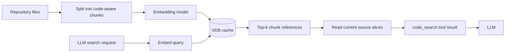

# Future plan for Mimir code search

## Question

Could vdb be used as a vector database tool for mimir? Like as a way to cache text data and allow an LLM to search a code base faster?

## Answer

I’m tracing Mimir’s existing tool, search, and configuration surfaces to judge whether VDB fits as an internal retrieval cache or whether it needs an embedding and indexing layer around it.

VDB already supplies the storage, ranking, metadata, persistence, and concurrent-read pieces. The missing capability is upstream: Mimir currently exposes file/shell tools but no embedding provider or repository chunk index, so VDB cannot search raw text semantically on its own.

Yes. vdb is a good foundation for an internal semantic code-search cache in Mimir, but it is not complete retrieval-augmented generation on its own.

It already provides the useful storage layer:

- Exact nearest-neighbor search over vectors with cosine, Euclidean, or dot-product distance: search.odin.
- IDs and arbitrary metadata stored with every vector: vdb.odin.
- Persistence across Mimir sessions with `save` / `load`: persistence.odin.
- Multiple concurrent searches via the database read lock, as documented in README.md.

For a codebase retrieval tool, the intended pipeline would be:

A practical VDB record could use:

- `Vector.data`: embedding from a dedicated embedding model.
- `Vector.id`: stable chunk identifier, such as `relative/path.odin:120-180`.
- `Vector.metadata`: compact source information such as language, symbol name, file modification timestamp, content hash, and perhaps a small preview.

Mimir would then expose a `search_code` tool next to its existing file tools in tools.odin. The tool would:

1. Embed the LLM’s query.
2. Call `vdb.search`.
3. Return the top matching file paths, line ranges, symbols, and short excerpts.
4. Let the LLM call the existing `read_file` tool only for the selected current files.

That last part matters: keep VDB as an index and use the filesystem as the source of truth. Returning full stored chunks can become stale after edits, while VDB search results can cheaply point the model toward the fresh source.

### What is still needed

- **Embedding API support.** Mimir’s AI client currently implements chat requests, including Ollama chat at `/api/chat`, but there is no embedding endpoint/client surface yet: client.odin, protocol_ollama.odin. You would add provider-neutral `embed_text` / `embed_texts` APIs, starting with Ollama’s embeddings endpoint or an OpenAI-compatible embeddings endpoint.
- **Code-aware chunking.** Do not embed whole files. Chunk by symbol where possible, otherwise by overlapping line or token windows. Preserve path, line range, language, and symbol information.
- **Index lifecycle.** On startup, load a project-specific VDB file. Index only changed/new files based on a content hash or modification time. Remove vectors for deleted files. Save after a successful batch update.
- **A project-specific cache location.** Similar to Mimir’s existing user cache convention in config.odin, but keyed by canonical project root and embedding model/version. The model/version is essential because vector dimensions and meanings vary by model.
- **Config.** The embedding model, endpoint/provider, chunk size, and max results should be configurable. An embedding model should generally be separate from the chat model.
- **Result shaping.** Mimir’s current tool system returns strings: tools_procs.odin. A `search_code` response should be structured JSON or concise text containing ranked hits, so the model can reliably choose the next `read_file` call.

### Performance boundary

Current VDB search computes distances for every vector and then sorts all results: search.odin. That makes it an exact $O(N \log N)$ search per query, plus $O(Nd)$ distance work for $N$ vectors of dimension $d$.

That is quite reasonable for a single project with perhaps thousands to tens of thousands of chunks, especially as a local-first alpha feature. For very large monorepos or many simultaneous users, it would need a top-$k$ selection optimization before sorting, then eventually an approximate nearest-neighbor index such as HNSW.

One design caution: `search` holds a read lock until `result_set_destroy` runs, so the code-search tool must copy or serialize its selected results and release the result set promptly. Otherwise indexing updates and cache saves will wait behind the search. This behavior is explicit in README.md and search.odin.

So the short answer is: **yes, VDB is well-suited to be Mimir’s local semantic index, with an embedding client, code chunker, incremental index manager, and a narrow `search_code` tool built around it.** It should complement `read_file` and shell search, not replace them: semantic retrieval finds likely concepts, while lexical search remains best for exact identifiers, error strings, imports, and syntax.
